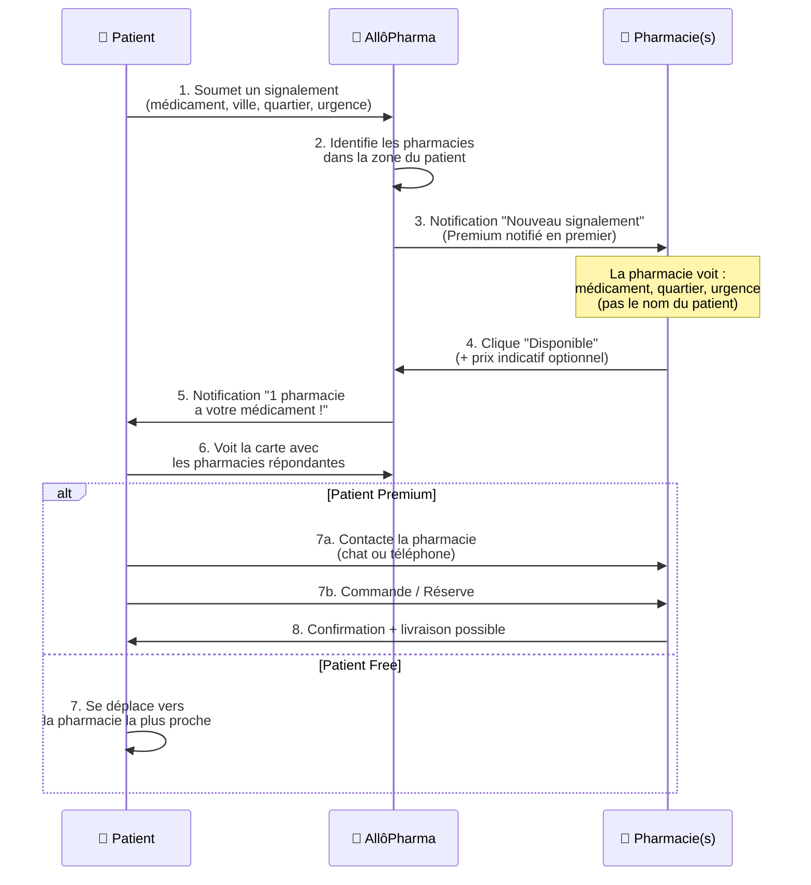

# 📋 Expression de Besoin Complète — AllôPharma MVP Marketplace

> **Contexte** : AllôPharma dispose aujourd'hui d'un formulaire de signalement anonyme ([signalement.component.html](file:///c:/MES-APPLICATIONS/PharmaLocate/allopharma-web/src/app/features/public/signalement/signalement.component.html)) et d'une landing page ([index.html](file:///c:/MES-APPLICATIONS/PharmaLocate/index.html)) orientée « baromètre des besoins ». Le pivot consiste à transformer ce flux en **marketplace de mise en relation Patient ↔ Pharmacie** avec un modèle freemium.

---

## 1. Vision Produit

**Problème** : Au Cameroun (et en Afrique subsaharienne), un patient peut visiter 3 à 5 pharmacies avant de trouver un médicament. C'est une perte de temps, d'argent et un risque pour la santé.

**Solution** : Un patient signale le médicament qu'il cherche → les pharmacies de sa zone qui disposent du produit reçoivent l'alerte et répondent « disponible » → le patient est notifié avec la localisation de la pharmacie.

**Modèle de revenus** : Freemium à 4 niveaux (2 côté patient, 3+ côté pharmacie).

---

## 2. Personas & Parcours Utilisateur

### 2.1 👤 Persona Patient

#### 2.1.1 Marie — Patiente gratuite (Free)
> *« Mon enfant a de la fièvre, le médecin a prescrit du Coartem. Je suis allée à 3 pharmacies, aucune ne l'a. Je n'ai plus d'énergie pour continuer. »*

**Parcours** :
1. Marie arrive sur AllôPharma (web ou mobile)
2. Elle remplit le formulaire de signalement : **médicament, ville, quartier, urgence**
3. ❌ Pas besoin de créer un compte (signalement anonyme comme aujourd'hui)
4. Son signalement est diffusé aux pharmacies de sa zone
5. Elle reçoit des **notifications in-app** (push ou sur la page) des pharmacies qui ont le médicament
6. Elle voit le **nom de la pharmacie + sa localisation sur la carte**
7. ❌ Elle **ne peut PAS** contacter directement la pharmacie (pas de chat, pas de téléphone affiché)
8. Elle doit se déplacer elle-même vers la pharmacie

**Frustrations vécues** :
- Ne sait pas quelle pharmacie a le médicament
- Se déplace inutilement
- Perd du temps quand c'est urgent (enfant malade, traitement chronique)
- Pas de visibilité sur les prix

**Fonctionnalités accessibles (Free)** :
| Fonctionnalité | Accès |
|---|---|
| Soumettre un signalement | ✅ Illimité |
| Recevoir des notifications « disponible » | ✅ Oui (in-app uniquement) |
| Voir le nom + localisation de la pharmacie | ✅ Oui |
| Contacter la pharmacie (chat/téléphone) | ❌ Non |
| Commander / Réserver | ❌ Non |
| Livraison | ❌ Non |
| Soumettre une ordonnance | ❌ Non |
| Historique des signalements | ✅ Basique (3 derniers) |

---

#### 2.1.2 Paul — Patient abonné (Premium)
> *« Je suis diabétique, j'ai besoin de Metformine chaque mois. Je veux pouvoir commander depuis chez moi et me faire livrer. »*

**Parcours** :
1. Paul crée un compte et souscrit à l'abonnement patient
2. Il soumet son signalement ou utilise la **recherche de médicament**
3. Il reçoit les réponses des pharmacies avec **détails complets** (nom, adresse, téléphone, distance, prix indicatif)
4. Il peut **contacter directement la pharmacie** via chat in-app ou voir le numéro
5. Il peut **commander / réserver** le médicament depuis l'app
6. Si la pharmacie propose la livraison → il peut **se faire livrer**
7. Il peut **soumettre une ordonnance** (photo/scan) pour que la pharmacie prépare ses médicaments
8. Il a accès à son **historique complet** + rappels de traitement

**Fonctionnalités accessibles (Premium Patient)** :
| Fonctionnalité | Accès |
|---|---|
| Soumettre un signalement | ✅ Illimité |
| Recevoir des notifications « disponible » | ✅ Oui (push + in-app) |
| Voir le nom + localisation de la pharmacie | ✅ Oui |
| **Contacter la pharmacie** (chat/téléphone) | ✅ **Oui** |
| **Commander / Réserver** | ✅ **Oui** |
| **Livraison** (si pharmacie compatible) | ✅ **Oui** |
| **Soumettre une ordonnance** | ✅ **Oui** |
| Historique complet + rappels traitement | ✅ Oui |
| Priorité dans les notifications | ✅ Oui |

---

### 2.2 🏥 Persona Pharmacien

#### 2.2.1 Dr. Kamga — Pharmacie sans abonnement (Free)
> *« Je veux savoir ce que les patients de mon quartier cherchent, mais je ne veux pas payer pour un service que je ne connais pas encore. »*

**Parcours** :
1. Dr. Kamga crée un compte pharmacien (inscription gratuite)
2. Il renseigne sa pharmacie : nom, adresse, position GPS, horaires
3. Il accède au **fil de signalements** de sa zone
4. Il voit **50 signalements par jour** maximum
5. Quand un signalement correspond à son stock → il clique **« Disponible »**
6. Sa réponse est envoyée anonymement au patient (nom + localisation)
7. ❌ Il **ne peut PAS** contacter le patient directement
8. ❌ Il **ne peut PAS** voir les coordonnées du patient

**Frustrations vécues** :
- Ne sait pas ce que les patients de son quartier cherchent vraiment
- Stock parfois inadapté à la demande locale
- Difficulté à capter une clientèle au-delà du voisinage immédiat
- Pas de visibilité digitale

**Fonctionnalités accessibles (Pharmacie Free)** :
| Fonctionnalité | Accès |
|---|---|
| Créer sa fiche pharmacie | ✅ Oui |
| Voir les signalements de sa zone | ✅ **50/jour** |
| Répondre « Disponible » | ✅ Oui |
| Contacter le patient | ❌ Non |
| Recevoir des commandes | ❌ Non |
| Recevoir des ordonnances | ❌ Non |
| Analytique / Statistiques | ❌ Basique |
| Mise en avant dans les résultats | ❌ Non |

---

#### 2.2.2 Dr. Njoya — Pharmacie abonnée (Standard)
> *« Je veux être plus réactif. 50 signalements/jour c'est insuffisant, et j'aimerais pouvoir contacter les patients qui ont un besoin urgent. »*

**Parcours** :
1. Dr. Njoya souscrit à l'abonnement Standard
2. Il voit **100 signalements par jour**
3. Il peut répondre « Disponible » ET **contacter le patient** via le chat in-app
4. Il reçoit les coordonnées de contact du patient (si le patient a accepté d'être recontacté)
5. Il peut proposer des alternatives si le médicament exact n'est pas en stock

**Fonctionnalités accessibles (Pharmacie Standard)** :
| Fonctionnalité | Accès |
|---|---|
| Créer sa fiche pharmacie | ✅ Oui |
| Voir les signalements de sa zone | ✅ **100/jour** |
| Répondre « Disponible » | ✅ Oui |
| **Contacter le patient** | ✅ **Oui** |
| Recevoir des commandes | ✅ Oui |
| Recevoir des ordonnances | ✅ Oui |
| Analytique / Statistiques | ✅ Détaillé |
| Mise en avant dans les résultats | ❌ Non |

---

#### 2.2.3 Dr. Ewane — Pharmacie Premium
> *« Ma pharmacie est bien située et bien achalandée. Je veux être le premier notifié, apparaître en priorité dans les résultats, et avoir de la pub. »*

**Fonctionnalités accessibles (Pharmacie Premium)** :
| Fonctionnalité | Accès |
|---|---|
| Voir les signalements | ✅ **Illimité** |
| Répondre « Disponible » | ✅ Oui |
| Contacter le patient | ✅ Oui |
| Recevoir des commandes | ✅ Oui |
| Recevoir des ordonnances | ✅ Oui |
| **Premier notifié** dans sa zone | ✅ **Oui** |
| **Pharmacie mise en avant** (badge, position) | ✅ **Oui** |
| **Tranches publicitaires** (bannières, push sponsorisés) | ✅ **Oui** |
| Analytique avancé | ✅ Complet |
| Support prioritaire | ✅ Oui |

---

## 3. Fonctionnalités Phares Décelées

### 3.1 🔑 Côté Patient (Features Clés)

| # | Fonctionnalité | Description | Priorité |
|---|---|---|---|
| P1 | **Signalement rapide** | Formulaire simplifié : médicament + ville + quartier + urgence. 30 secondes max. | 🔴 Critique |
| P2 | **Notification de disponibilité** | Le patient reçoit une alerte quand une pharmacie répond « disponible » | 🔴 Critique |
| P3 | **Carte des pharmacies répondantes** | Vue carte montrant les pharmacies qui ont le médicament | 🔴 Critique |
| P4 | **Suivi en temps réel** | Statut du signalement : en attente → X pharmacies ont répondu | 🟠 Important |
| P5 | **Contact pharmacie** (Premium) | Chat in-app ou affichage du téléphone | 🟠 Important |
| P6 | **Commande / Réservation** (Premium) | Réserver le médicament depuis l'app | 🟡 Souhaitable |
| P7 | **Soumission d'ordonnance** (Premium) | Upload photo/scan d'ordonnance | 🟡 Souhaitable |
| P8 | **Livraison** (Premium) | Demander la livraison si la pharmacie le propose | 🟡 Souhaitable |
| P9 | **Historique & Rappels** | Historique des signalements + rappels de renouvellement | 🟢 Nice-to-have |
| P10 | **Recherche de médicament** | Chercher un médicament et voir les pharmacies qui l'ont en stock | 🟠 Important |

### 3.2 🔑 Côté Pharmacien (Features Clés)

| # | Fonctionnalité | Description | Priorité |
|---|---|---|---|
| PH1 | **Fil de signalements** | Liste des signalements actifs dans sa zone géographique | 🔴 Critique |
| PH2 | **Réponse « Disponible »** | En 1 clic, la pharmacie confirme avoir le médicament | 🔴 Critique |
| PH3 | **Quota de signalements** | Limité selon le plan : 50/jour (Free), 100 (Standard), illimité (Premium) | 🔴 Critique |
| PH4 | **Fiche pharmacie** | Profil complet : nom, adresse, GPS, horaires, services | 🔴 Critique |
| PH5 | **Contact patient** (Standard+) | Pouvoir contacter le patient via chat | 🟠 Important |
| PH6 | **Gestion de stock** | Mise à jour rapide des médicaments en stock | 🟠 Important |
| PH7 | **Réception d'ordonnances** (Standard+) | Recevoir et traiter les ordonnances soumises | 🟡 Souhaitable |
| PH8 | **Gestion des commandes** (Standard+) | Recevoir et confirmer les réservations | 🟡 Souhaitable |
| PH9 | **Priorité de notification** (Premium) | Être alerté en premier des signalements | 🟠 Important |
| PH10 | **Mise en avant** (Premium) | Badge premium, position prioritaire dans les résultats | 🟡 Souhaitable |
| PH11 | **Publicité** (Premium) | Bannières, promotions sponsorisées | 🟢 Nice-to-have |
| PH12 | **Analytique** | Stats : médicaments les plus demandés, tendances, conversion | 🟠 Important |

---

## 4. Analyse de l'Existant vs. Ce Qui Manque

### ✅ Ce qui existe déjà

| Composant | Fichier(s) | État |
|---|---|---|
| Formulaire de signalement anonyme | [signalement.component.html](file:///c:/MES-APPLICATIONS/PharmaLocate/allopharma-web/src/app/features/public/signalement/signalement.component.html), [signalement.component.ts](file:///c:/MES-APPLICATIONS/PharmaLocate/allopharma-web/src/app/features/public/signalement/signalement.component.ts) | ✅ Fonctionnel |
| Entité `SignalementAnonymeEntity` | [SignalementAnonymeEntity.java](file:///c:/MES-APPLICATIONS/PharmaLocate/allopharma-api/src/main/java/cm/allopharma/api/module/signalement/entity/SignalementAnonymeEntity.java) | ✅ En DB |
| Entité `PharmacieEntity` | [PharmacieEntity.java](file:///c:/MES-APPLICATIONS/PharmaLocate/allopharma-api/src/main/java/cm/allopharma/api/module/pharmacie/entity/PharmacieEntity.java) | ✅ Riche (GPS, livraison, ordonnance digitale) |
| Rôles : `patient`, `pharmacien`, `medecin`, `admin` | [TypeCompte.java](file:///c:/MES-APPLICATIONS/PharmaLocate/allopharma-api/src/main/java/cm/allopharma/api/module/auth/enums/TypeCompte.java) | ✅ Définis |
| Dashboard pharmacien (stock, catalogue, ordonnances, stats, gardes) | [app.routes.ts](file:///c:/MES-APPLICATIONS/PharmaLocate/allopharma-web/src/app/app.routes.ts) L44-L128 | ✅ Routes existantes |
| Dashboard patient (recherche, ordonnances, pharmacies, profil) | [app.routes.ts](file:///c:/MES-APPLICATIONS/PharmaLocate/allopharma-web/src/app/app.routes.ts) L196-L349 | ✅ Routes existantes |
| Landing page + SEO | [index.html](file:///c:/MES-APPLICATIONS/PharmaLocate/index.html) | ✅ Soigné |
| Espace pharmacien (landing B2B) | [espace-pharmacien.html](file:///c:/MES-APPLICATIONS/PharmaLocate/espace-pharmacien.html) | ✅ Existe |
| Baromètre avec stats temps réel | Signalement component | ✅ Fonctionne |
| Module `stock`, `ordonnance`, `notification` | API modules | ✅ Présents |

### ❌ Ce qui manque (à développer)

| Composant manquant | Description | Priorité |
|---|---|---|
| **Système d'abonnement / Plans** | Entité `Plan`, `Abonnement`, logique de quotas | 🔴 Critique |
| **Fil de signalements pour pharmacien** | Nouvelle vue : les pharmacies voient les signalements de leur zone | 🔴 Critique |
| **Bouton « Disponible »** | Workflow pharmacie → patient, avec notification push | 🔴 Critique |
| **Notification au patient** | Le patient reçoit « X pharmacies ont votre médicament » | 🔴 Critique |
| **Vue résultat patient** | Le patient voit la liste des pharmacies qui ont répondu + carte | 🔴 Critique |
| **Quotas par plan** | Limiter les signalements vus : 50, 100, illimité | 🔴 Critique |
| **Chat in-app** | Messagerie patient ↔ pharmacie (plans payants) | 🟠 Important |
| **Soumission d'ordonnance** (patient → pharmacie) | Déjà des routes mais pas de flux lié au signalement | 🟡 Souhaitable |
| **Commande / Réservation** | Workflow : réserver → confirmer → retirer/livrer | 🟡 Souhaitable |
| **Module livraison** | Suivi : commandé → en préparation → livré | 🟡 Souhaitable |
| **Pharmacie mise en avant / Pub** | Badge premium, position prioritaire, bannières pub | 🟢 Phase ultérieure |
| **Paiement en ligne** (abonnement) | Intégration paiement mobile (Orange Money, MTN MoMo) | 🟠 Important |

---

## 5. Flux Principal — « Le Parcours Idéal »

---

## 6. Modèle d'Abonnement Détaillé

### 6.1 Côté Patient

| | **Gratuit** | **Premium Patient** |
|---|---|---|
| **Prix** | 0 FCFA | ~2 000 – 3 000 FCFA/mois |
| Signalements | Illimité | Illimité |
| Notifications disponibilité | ✅ In-app | ✅ Push + In-app |
| Voir pharmacie + carte | ✅ Nom + position | ✅ Détails complets |
| Contacter la pharmacie | ❌ | ✅ Chat + téléphone |
| Commander / Réserver | ❌ | ✅ |
| Livraison | ❌ | ✅ (si pharmacie compatible) |
| Ordonnance digitale | ❌ | ✅ |
| Historique complet | 3 derniers | ✅ Illimité |

### 6.2 Côté Pharmacie

| | **Free** | **Standard** | **Premium** |
|---|---|---|---|
| **Prix** | 0 FCFA | ~15 000 FCFA/mois | ~35 000 – 50 000 FCFA/mois |
| Fiche pharmacie | ✅ | ✅ | ✅ |
| Signalements visibles/jour | **50** | **100** | **Illimité** |
| Répondre « Disponible » | ✅ | ✅ | ✅ |
| Contacter le patient | ❌ | ✅ | ✅ |
| Recevoir commandes | ❌ | ✅ | ✅ |
| Recevoir ordonnances | ❌ | ✅ | ✅ |
| Priorité notification | ❌ | ❌ | ✅ **Premier notifié** |
| Mise en avant | ❌ | ❌ | ✅ Badge + top résultats |
| Publicité / Bannières | ❌ | ❌ | ✅ |
| Analytique | Basique | Détaillé | Complet + export |
| Support | Standard | Standard | ✅ Prioritaire |

---

## 7. Priorisation en Phases

### 🚀 Phase 1 — MVP (4-6 semaines)
> Objectif : Boucler le parcours Patient signale → Pharmacie répond → Patient notifié

1. **Adapter le signalement existant** pour créer un « ticket » trackable
2. **Vue pharmacien : Fil de signalements** (liste des signalements de sa zone)
3. **Bouton « Disponible »** côté pharmacien
4. **Page patient : résultats** (liste des pharmacies qui ont répondu + carte)
5. **Système de notification** basique (in-app)
6. **Quotas** : Free = 50 signalements/jour pour la pharmacie

### 📈 Phase 2 — Monétisation (2-4 semaines après Phase 1)
> Objectif : Introduire les plans payants

7. Entités `Plan` + `Abonnement` en DB
8. Intégration paiement (Orange Money / MTN MoMo)
9. Quotas par plan (50 / 100 / illimité)
10. Contact patient ↔ pharmacie (chat) pour plans payants
11. Priorité de notification pour Premium

### 🛒 Phase 3 — Commerce (4-6 semaines après Phase 2)
> Objectif : Commande, ordonnance, livraison

12. Commande / Réservation
13. Soumission d'ordonnance liée au signalement
14. Flux livraison (si pharmacie compatible)
15. Mise en avant des pharmacies Premium

### 📊 Phase 4 — Croissance
> Objectif : Publicité, analytics avancés, expansion

16. Tranches publicitaires pour Premium
17. Analytics avancés + exports
18. Application mobile native (ou PWA améliorée)
19. Expansion géographique au-delà de Douala

---

## 8. Contraintes Techniques Identifiées

| Contrainte | Impact | Solution proposée |
|---|---|---|
| Le signalement actuel est 100% anonyme (pas de `user_id`) | Impossible de notifier un patient anonyme | Ajouter un `session_token` ou `signalement_uid` trackable côté client (cookie/localStorage) |
| Pas d'entité `Abonnement` / `Plan` en DB | Pas de gestion de quotas | Créer les entités + migration SQL |
| Pas de système de messagerie in-app | Pas de chat | Module `messaging` à créer (WebSocket ou polling) |
| PharmacieEntity n'a pas de champ `plan` | Impossible de différencier Free/Standard/Premium | Ajouter `plan_actuel` ou relation vers `Abonnement` |
| Pas de système de notification push | Patient ne sait pas quand une pharmacie répond | Intégrer Firebase Cloud Messaging (FCM) ou Web Push API |

---

## 9. Questions Ouvertes pour Décision

> [!IMPORTANT]
> Ces questions nécessitent une décision de ta part avant de démarrer le développement.

1. **Patient anonyme vs. inscrit** : Le patient Free doit-il créer un compte (email/téléphone) pour recevoir les notifications ? Ou on garde l'anonymat total avec un système de « ticket » consultable via URL unique ?

2. **Prix des abonnements** : Les prix suggérés (2 000-3 000 FCFA patient, 15 000-50 000 FCFA pharmacie) sont-ils dans la bonne fourchette pour le marché camerounais ?

3. **Phase 1 focus** : Veut-on commencer par le flux web uniquement (Angular), ou aussi l'app mobile ([allopharma-mobile](file:///c:/MES-APPLICATIONS/PharmaLocate/allopharma-mobile)) ?

4. **Paiement** : Quel prestataire de paiement mobile privilégier ? (CinetPay, Campay, NotchPay, direct MTN/Orange API ?)

5. **Landing page** : Faut-il refondre la landing page actuelle pour refléter le nouveau positionnement « marketplace » plutôt que « baromètre de signalements » ?

---

## 10. Résumé Exécutif

| Dimension | Actuel | Cible MVP |
|---|---|---|
| **Signalement** | Anonyme, unidirectionnel | Bidirectionnel avec réponse pharmacie |
| **Pharmacien** | Passif (voit les stats) | Actif (reçoit et répond aux signalements) |
| **Patient** | Aucun retour | Notifié des pharmacies qui ont son médicament |
| **Monétisation** | Aucune | Freemium 4 niveaux |
| **Engagement** | Formulaire one-shot | Boucle de feedback continue |

> **La transformation clé** : Passer de « le patient signale dans le vide » à « le patient signale et reçoit une réponse concrète d'une pharmacie avec sa localisation ». C'est cette **boucle de valeur** qui justifie l'abonnement et crée la rétention.
